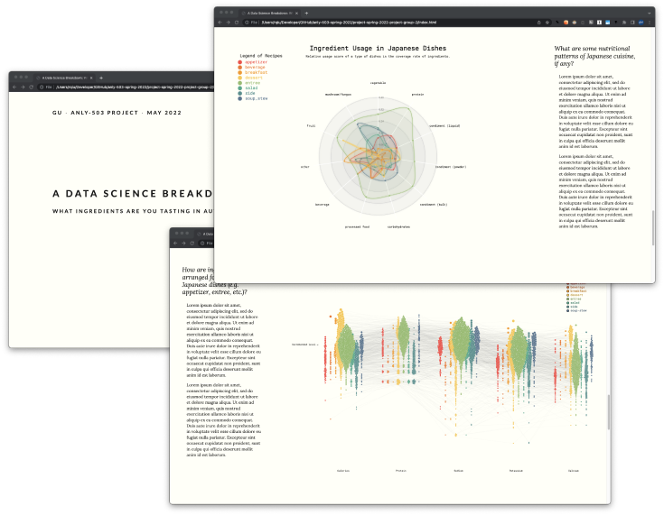

# ANLY 503 Project: Interactive, Data-driven Visual Narrative

## Project Overview and Objective

Over the rest of the semester, you will work towards creating an interactive, data-driven story. To extract value from large and complex datasets, data visuals have evolved over the past decade from static charts and graphs to interactive and immersive visuals that tell a story. This allows the audience to modify elements of the data being presented and manipulate the graphical representation. Static charts and graphs do not have the capability to adjust the visual, such as hovering, sorting and scaling. Interactive visualizations allow users to generate transformative insights, identify relationships, view trends and create meaningful stories through data.

Data storytelling is the execution of describing data through visualizations by building a compelling narrative around a dataset. This adds meaningful context to the data and helps the audience easily understand the information.

In your work as data scientists, in addition to doing modeling and machine learning work, you will be responsible (either individually or as part of a team) for providing the following as part of a project:

* **Findings:** what does the data say?
* **Conclusions:** what is your interpretation of the data?
* **Recommendations:** what can be done to address the question/problem at hand

Your narrative will focus on the first two above. It should allow the audience to be able to understand the topic you are analyzing, presenting and discussing. The visual narrative should not attempt to tackle and solve a large scale problem, that is not the objective. The objective is simply to find a topic of interest, work with the data, and present it to an audience that may not know very much about the subject using a data-driven narrative.

## Deliverable

The project will be delivered through an interactive `index.html` self-contained website.

The interactive visual narrative will not include any server side or custom backends (Node.js, Python, etc) and database systems, such as Postgres or MySQL, although they could facilitate more powerful applications. In this project, your efforts will be purely on the data manipulation, analysis, and presentation using front-end development (JavaScript, D3, HTML, CSS) and scripting languages R and Python (with appropriate packages that wrap D3 or its variants). More details will be provided later.

You can use CSS frameworks, such as [Bootstrap](https://getbootstrap.com/), [Materialize](https://materializecss.com/), or [Distill](https://distill.pub/about/) and include external libraries (jQuery, leaflet.js, moment.js, etc.).  Layers such as NVD3, Vega-lite, Highcharts, etc. are allowed. Many of these have wrapper packages in R and Python. For example, the package `altair` (in both [R](https://vegawidget.github.io/altair/) and [Python](https://altair-viz.github.io)) wraps Vega-lite, and the package `plotly` (in both [R](https://plotly.com/r) and [Python](https://plotly.com/python)), among other packages, wraps D3. Other packages you may use are any of the [`htmlwidgets`](https://www.htmlwidgets.org) packages in R, [`bokeh`](https://bokeh.org) or [`holoviz`](https://holoviz.org) (and it's accompanying ecosystem) in Python, as well as specialized packages for geospatial ([`leaflet`](https://rstudio.github.io/leaflet/), [`tmap`](https://geocompr.robinlovelace.net/adv-map.html) in R, [`folium`](https://python-visualization.github.io/folium/index.html) in Python) and networks ([`igraph`](https://igraph.org), [`NetworkX`](https://networkx.org), `bokeh`, `plotly`). Any other packages you may use from R or Python or Javascript requires prior instructor approval.

### Milestones and instructions

All instruction documents are in the `instructions/` directory.

There are four major milestones:

1. Dataset proposal: you will propose a dataset(s) to be used, the source, and the reason for using this dataset. The instructional team has the right to reject the dataset if it will not allow for a succcessful and comprehensive narrative. [Link to `dataset-proposal.md`](instructions/dataset-proposal.md)
1. Project proposal: a formal propsal based on the approved dataset. [Link to `project-proposal.md`](instructions/project-proposal.md)
1. Mid-point delivery: work in progress submission where most of the visualizations are developed but not finalized. [Link to `midpoint.md`](instructions/midpoint.md)
1. Final delivery: the interactive narrative with all of its components. [Link to `final.md`](instructions/final.md)

All of your work will be done within the team GitHub repository.

## Project requirements

Your narrative must include, at a minimum, the following elements:

* **At least 5** different views / visualization components (e.g. 3 bar charts only count as 1 component).
* At least 1 of these views must be an **"innovative view"** that is either:

     1. an extension of an existing visualization type, or
     2. a novel visualization type.

     **Note: an interactive visualization is not an _innovative view_.**

* Multiple views coordinated with linked highlighting. A click/hover/selection interaction within one view must trigger a change in a different view. At least 2 views need to be linked.
* Interactive tooltips, in at least one view, that are shown when users hover over marks.
* Custom theming, look and feel
* Appropriate narrative, captioning, etc

## Evaluation

The project will be evaluated using the following high-level criteria:

* Visual design: effectiveness of visualizations and interactions, which should link back to usage scenarios, tasks, and intended audience
* Level of technical difficulty and quality of implementation
* Whether the visual narrative answers a question, tells a story, and addresses the goals and requirements
* Quality and clarity of your writing and overall presentation, including your own visual style
