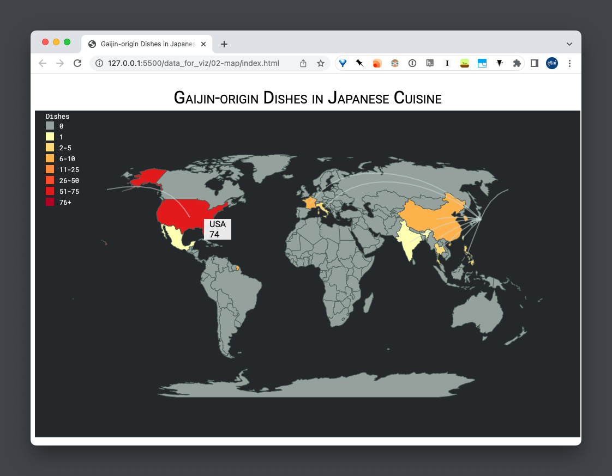

# Writeup for Part 02: Foreign-origin dishes in Japanese cuisine

Author: Rui Qiu (rq47)

## Design Rationale

### interaction

Although our dataset is not ideal for geospatial visualization, we still manage to extract some anectotes presentable on a map. Arguably, we could use a better visual representation such as a bar chart or an arc diagram to show the origins of foreign dishes in Japanese cuisine. However, as geospatial visualization is required for the project, an D3 interactive map is implemented for this part.

The only interaction component (by far) is the hovering tooltip on the highlighted countries, where a window of text information is displayed.
### data abstraction

> (including a characterization of the raw data types and their scale/cardinality, and of any derived data that you decided to compute)

The dataset used here is `international-dishes.csv` which is a summary of previously scraped data. It is a 10-by-3 table, where the columns are country `name`, `total` number of dishes originated from this country, and the `code` of the country.

Another variation of the dataset `international-dishes-cat.csv` is generated by the same script `get-dishes-origin.R`. It's the same summary data by divided by the dish category.

Two additional data sources are used for the visualization:

- `world-110m.geojson` from [TopoJSON](https://github.com/topojson/world-atlas) is used to generate the country and land collection.
- An array of country coordinates are manually collected for the arcs displayed in the visualization. Each arc is defined by the coordinates of the two countries it connects.

```{JavaScript}
var link = [
    {type: "LineString", coordinates: [[126.9780, 37.5665], [139.6503, 35.6762]]},
    ...
]
```

### task abstraction

The task here is to give the audience a rough idea about the foreign origins of the dishes in Japanese cuisine.

### visual encoding choices

Some considerations in visual encoding:

- Two types of fonts are used: Roboto (sans-serif) and Roboto Mono (monospace). The Sans-Serif font is used for descriptive texts such as the title and legend title. The monospace font is used for numbers and miscellaneous texts.
- The thresholds of the legends are not proportional the the real gap. But considering the size of the data presented in the map, the priority is to show the difference in quantity. Therefore, the gaps between thresholds are set manually.
- The opacity of arcs is tuned down to avoid distracting the text information.
- The hovering tooltip has a rather long duration and delay to guarantee the visibility of text information.

## Progress

### any change since proposal

The design of the map is consistent with the proposal.

### storytelling goal/user task

> describe how visualization enable the tasks you set out to facilitate or successfully communicate the story you want to tell

Our story focuses on answering "what makes Japanese food Japanese", and this visualization gives another perspective to show the influence of foreign cusines on Japanese food. That is to say, the authenticity of a country's dish, although might be defined by its unique set of ingredients, it is still inevitable to ignore external impacts.
### todo list

- [ ] Tweak the visualization styles to match the overall theme
- [ ] Add a d3 chart (e.g. a bar chart of number of dishes by category) within a tooltip

## Screenshots

>  Add at least one screenshot to your document that illustrates your current prototype. Make sure that all of the views you have implemented so far are documented in screenshots, you may need more than one.



## Data Preprocessing Pipeline

- The preprocessing pipeline can be accessed at `data_for_viz/02-map/get-dishes-origin.R`. It can be concluded in the following three steps:
    - Iteratively load JSON files from `data/` directory and save the sub-directory information as `category` of a dish.
    - Count the total number of dishes by origin (and by category).
    - Mutate the country adjective to country name and code (e.g. “American” to “United States” and “USA”).
    - Save the summarized data to `international-dishes.csv` and `international-dishes-cat.csv` respectively.
