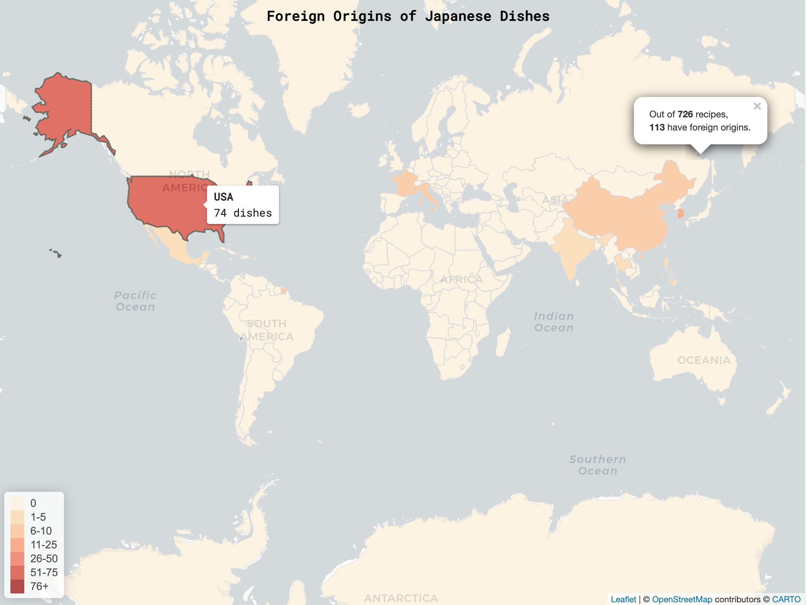
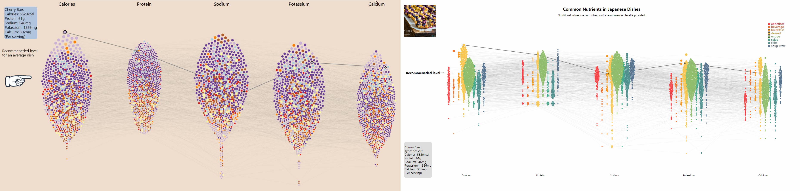
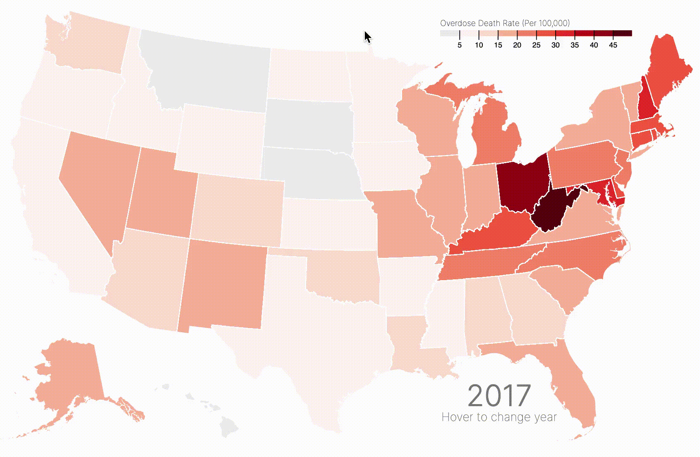

# Final Report of Group 2

May 1, 2022

## Team

- Jingsong Gao (jg2109)
- Yu Kang (yk685)
- Chao Li (cl1486)
- Ercong Luo (el890)
- Rui Qiu (rq47)

## 1. Visualization

### 1.1 Barplot + Boxplot of Frequent Ingredients

The first visualization is an interactive compound figure with a barplot and a boxplot.

**Data collection and essential data transformation** include:

1. Compiling a list of frequency counts for ingredients in the `recipes` corpus, subsetting the top 40 ingredients by count, and then classifying them (by hand) into categories of {'Japanese exlusive', 'general Asian', 'others'}.
2.  For each of the top-40 ingredients, download Google search trend time-series data from [trends.google.as](https://trends.google.as/trends/?geo=US).

Data from each of the two steps are used to build the barplot and the boxplot respectively. **Encoding choices** include:

- **Geometry**. The length of each vertical bar conveys the frequency count for each top ingredient, and each box in the boxplot represents the empirical distribution of search trends for that ingredient in the past five years. The relative positions of boxplots reveals the relative public awareness for each Japanese exclusive ingredient.
- **Axis sharing**. The sequence for the bars in the barplot is according to frequency count, and the boxplot shares the x-axis with the barplot so that it is easy to visualize whether most frequenly used Japanese ingredients have higher public awareness, and vice versa.
- **Fill color**. The most important category of ingredients is 'Japanese exclusive', and therefore ingredients such as sugar and salt in the 'others' category are filled in as grey to let the 'Japanese exclusive' ingredients stand out.

**Interactive Features**:

- **Hovering**. Because 40 is a large number of ingredients for the x-axis, hovering over a bar in the barplot will reveal which ingredient it is and in how many Japanese recipes it appears. This interactivity compensates for a densely populated x-axis, and makes the interface user-friendly. Hovering over a box in the boxplot will also reveal greater details such as quantiles, median, and outliers for the time series distribution of Google search trends.
- **Filtering by legend**. Clicking on a legend will filter out that category of ingredients from the barplot. All top-40 ingredients are included, but if the user wants to focus strictly on 'Japanese exclusive' ingredients, they can do so either by clicking each of the other two legends once, or by clicking on the legend 'Japanese exclusive' twice.

### 1.2 Recipe, Ingredients Network

The second visualization is a network of recipes and ingredients.

**Data transformation**:

 - **Network data structue**. The recipe-ingredient relationship is considered as a network where 1. recipes and ingredients are nodes, and 2. a recipe node and an ingredient node are connected when the the former contains the latter. The network is stored as **adjacency lists**, where one JSON file is contructed for each recipe and the file contains a list of connected recipe nodes. In order to prepare the JSON files for a D3 network visualization, the JSON files are parsed into **a list of nodes and a list of edges**.

**Encoding choices**:

 - **Node clustering and fill color**. There are two types of nodes: recipes and ingredients. Each type of node has several subcategories. To create an organized and hollistic view of such a large network, each subcategory of nodes is filled with a different color and clustered together.
 - **Legend**. Recipe legends and ingredient legends are included to specify the subcategories of nodes.

**Interactivity**:

 - **Hovering**. When hovering over one node, all other connected nodes as well as connection edges are highlighted. Meanwhile, a tooltip shows name, type of node, node subcategory, frequency of this node.
 - **Mouse click**. Similar to hovering, a node and all its adjacent nodes will be highlighted, but clicking allows multiple selection and the highlighting won't disappear until you click on canvas.
 - **Filtering by legend**. By clicking on a legend item, all nodes in that category and their adjacent nodes will be highlighted.

**Screenshot**:

### 1.3 Nutrition Beeswarm

This network plot is implemented by a style of Beeswarm plot.

**Data preparation**:

 - **Network data structure**. Nutritional values from the original recipes corpus are extracted as a wide-form table (left figure below). Each recipe name is a node and shows up five times in the visualization for that there are 5 relevant nutritional value categories. All nodes with the same recipe name are connected, and therefore an adjacency list is constructed from the wide-form table to specify connections seen in the right figure below.

**Encoding choices**:

- **Axis position**. The x-axis position represents the category of nutritional values. The y-axis of the plot represents the normalized nutritional value of a recipe in that nutrition category, the normalization is according to daily recommendations and serving size.
- **Graph representation**. Each recipe name is a node and shows up five times for that there are five nutritional value categories for this visualization. Two nodes are connected by an undirected edge if they are the same recipe, and the connection edges are useful for tracking the same recipe across factors in the x-axis because there are many recipes represented in the dataset.
- **Node clustering and fill color**. The node position clustering and fill color are both encoded by the category of a recipe. Position by category gives structure to the visualization to show that there are differences in nutritional value distribution by category, but because some categories such as desserts and entrees include many recipes and therefore create positional overlap, the fill color is encoded by the same feature to create further category distinctions.
 - **Tooltip**. The remaining white space on the top left and the bottom left is reserved for tooltips displaying further information such as a picture of the dish from the recipe and a list of nutritional values.

**Interactivity**:

 - **Hovering**. When hovering on a node, all adjacent nodes and edges are highlighted.
 - **Mouse click**. If a user wants to see a picture of the dish or the specific nutritional values of a dish, they can click on this node to highlight adjacent nodes/edges, and a snapshot of the dish will be displayed at the top left corner and the exact nutritional values will be displayed at the bottom left corner. Clicking on any whitespace cancels the highlights and hides the displayed tooltips.
- **Legend filtering**. Clicking on a legend filters out recipes of that category only.

**Screenshot**:

### 1.4 Ingredients Radar Plot

This third plot is implemented by a radar plot.

**Data preparation and transformation**:

- **Radar plot data structure**. The `name` and `ingredients` fields in the corpus of JSON files are summarized to create a table counting ingredient frequencies by recipe category and ingredient name. Then, all ingredients are extracted as a set and then put into label columns by hand. By classifying all the ingredients into 11 labels, all the ingredients under each sub-class are counted.
- **Data transformation**. Instead of using the original count number, the ingredient frequency was transformed into a percentage to retard the effect of extreme values.

**Encoding choices**:

- **Color palette**. All color theme was chosen for a harmonious style with other plots. Since there are more than three colors needed for each ingredient class, a red-to-green color is chosen to enhance a better comparison.
- **Mouse action**. Since the plot needs to compare ingredient percentages among different receipt classes and different ingredient classes, a mouse action was added to the plot. When the mouse goes above the plot, it will give a highlighted part for that sub-class. This interactiveness could also be achieved by clicking the corresponding legend labels.
- **Legend and caption**. The legend and the detailed caption is added to provide more instructive information on the plot.

**Interactivity**:

 - **Hovering**. When hovering over the radar circle, the corresponding part will be highlighted for a clearer presentation.
 - **Mouse click**. Compared with hovering, clicking on the legend allows an alternative selection on required highlighted part in case of missing highlight the wrong part.

**Screenshot**:

### 1.5 Choropleth of Foreign Dish Origins

The final visualization is an **interactive choropleth of foreign-origins of Japanese dishes.**

**Data preprocessing** for this visualization includes:

- Extracting dish origin from the `origin` field of corpus JSON files, this includes:
    - looping through all sub-directory,
    - using tidyverse functions `group_by` and `summarise` to calculate the total number of dishes by country other than Japan itself,
    - adding two new columns (country name and shortcode) based on the origin (which are adjectives) to match the geojson file used to plot the country borders.

**Encoding choices** include:

- **Color palette**. The data here are quite sparse. To highlight the incremental difference in quantities, a sequential palette is implemented for the visual cue for how those quantities are distributed. Additionally, the palette segments are manually tuned to make the contrast between "zero dishes" and "at least one dish" stand out.
- **Transparency**. The polygon plotted is a transparent layer, so that on-demand information such as geographical location names are still visible.
- **Polygon boundary**. The selected (by hovering) polygon will show a thick bounrdary to emphasize this selection.
- **Font selection**. Roboto Mono (monospace) is used for consistency with the other visualizations.

**Interactive Features**:

- **Hovering + Tooltip**. When the user hovers the cursor over a polygon (a country or a region), the polygon will be highlighted, and a corresponding tooltip shows up to give the exact number of Japanese dishes originated from the selected country.
- **Popup marker**. On the default view right after the map is first loaded, a popup marker shows up at the polygon representing Japan. It tells the user the proportions of Japanese dishes for each foreign origin country/region.
- **Map positioning**. We disabled the common interactions like zooming and panning in this one to keep the effective area of this map in the center of the user's viewport.

## 2. Reflection

### Q1: Describe how your project has developed from your initial proposal, through your first submission, to your final product. How have your visualization goals changed?

- **1. Compound barplot and boxplot**. The goal for this visualization was consistent through all stages of the project, which was to visualize the most frequently used Japanese ingredients. The barplot was implemented at midpoint, but credits to Rui the additional time-series visualization of Google search trends could provide additional insight. We wanted the time-series visualization to share the x-axis of the barplot in order to reveal the anomaly ingredients that are frequently used in Japanese cuisine but have very little public awareness on Google search. We tried implementing a ridgeline plot (a series of density plots) but it was too hard to integrate the two subplots using plotly.js. Eventually we settled on a boxplot because it conveyed sufficient statistical insight to make the point. Furthermore, color tuning took additional work because the default visual colors gave a bright color to the 'others' category of ingredients that don't matter as much, such as salt and sugar. Color and font were also adjusted to match the style of other visualizations to maintain a smooth narrative flow from the design standpoint.
- **2. Network.** In this project, the goal of visualizing the recipe-ingredient network has not changed much. The main components (nodes and edges) and the basic interaction features (hovering, mouse click events) were developed at the midpoint submission. Subsequent work was focused on additional components (legend) and extra interaction feature (multi-select click events).
- **3. Beeswarm.** The goal of visualizing the nutritional value distributions of recipes stayed consistent from mid-point to the final stage. At mid-point, recipe categories are encoded by fill-color only. Building upon this iteration, we decided that this wasn't enough: spatially separating recipes by recipe category will make the visualization easier to navigate, and additionally the distribution of each nutritional value for each recipe category can be directly visualized. Without spatial separation, comparisons of nutritional values across recipe categories are impossible. For a direct comparison of these implementations, screenshots are included below. Mid-point visualization without spatial separation is on the left, while the final product is on the right.

- **4. Radar plot.** The goal of the visualization stayed consistent through mid-point and final stages. At mid-point, the implementation was a windrose done via Plotly, with more necessary details to be added. However, the additional on-demand details could not be added using Plotly features, and therefore the final implementation was done via D3.js. In the final version of the radar plot, three additional features are visualized: recipe category, ingredient category, and ingredient usage proportion in each recipe category. Interactive filters via legends are also manually implemented.
- **5. Choropleth.** The general goal of the map remains the same as the one proposed, that is to show the international elements in Japanese cuisine.
### Q2: How have your technical goals changed?

The technical goals stayed the same for the beeswarm visualization and the recipe-ingredient network. As for the rest:

- **1. Compound barplot and boxplot.** The biggest technical challenge was to combine the time-series visualization in a way that share the x-axis with the barplot on top. The reason why a ridgeline plot couldn't work was that incorporating it would have to increase the canvas size way too much. Another feature that we wanted to implement was a dropdown filter bar that could filter both figures by the categories of recipes. The final implementation we had visualizes the entire set of recipes across recipe categories. We actually wrangled data and implemented a prototype using Altair on Python, but what prevented us from deploying it in the final visualization was that the developers of Altair have not implemented a default view feature for plots with a filtering dropdown bar ([see this Github thread](https://github.com/altair-viz/altair/issues/807)). We did not have enough time to try a third technology besides plotly.js and altair.js, so we abandoned the recipe filtering feature.
- **2. Radar plot.** There are two major changes in this plot. Firstly, the windrose plot was substituted with the radar plot. One of the advantages of the radar plot over the windrose plot is a smoother comparison. Secondly, the mid-point implementation was done via `Plotly` while the final product was done using `D3.js`. `D3.js` eliminated the constraints posed by `Plotly` functionalities and allowed for adding in additional on-demand information.
- **3. Choropleth.** The major change we made from draft version to final version is to the shift from pure D3 to JavaScript-based `leaflet`. The inconsistency of the function names in different D3 versions is the last straw. Although some features are discarded, it is easier to tweak some miscellaneous components in the map, while achieving the same goal of this visualization.

### Q3: How realistic was your original proposal in terms of what is technically possible in D3?

- **1. Compound barplot and boxplot.** It was not going to be a challenge to implement this visualization in D3 as it is one of the most common plots, but plotly.js has sufficient features for this plot and therefore D3 was not necessary.
- **2. Network.** For the network viz, D3 enabled all features we would like to implement in our original proposal. D3-force allows us to locate nodes based on their categories and connections. It was capable of creating a bipartite and clustered network of recipes and ingredients, as desired. D3-event also allowed us to customize hover/click events of nodes and legends which gives the user information on-demand via interactivity.
- **3. Beeswarm.** For the beeswarm viz, similar to the network viz, D3-force helps position nodes according to x-axis based on nutritional values and cluster position based on recipe category. Mouse click/hovering also displays detailed on-demand information per the user's inquiry. Finally, the y-axis position encoding is according to the relative nutritional value for each recipe, leading to a hierarchical view of clusters (nutrition category) and sub-clusters(dish type).
- **4. Radar plot.** For the radar plot, D3 provided additional features compared to `Plotly` such as manual customization of legend position and the radar type.
- **5. Choropleth.** D3 had all functionalities required to build the choropleth.

### Q4: Was there anything you wanted to implement that you ultimately couldn’t figure out how to do? If so, then what workarounds did you employ, or did you abandon your original idea?

- **1. barplot.** The final implementation we had visualizes the entire set of recipes across recipe categories. We actually wrangled data and implemented a prototype using Altair on Python, but what prevented us from deploying it in the final visualization was that the developers of Altair have not implemented a default view feature for plots with a filtering dropdown bar ([see this thread on Altair's Github repo](https://github.com/altair-viz/altair/issues/807)). Having tried in both Plotly and Altair, we did not have enough time to try a third approach such as D3. Therefore we abandoned the dropdown filter feature.
- **2. Network.** All desired features were implemented.
- **3. Beeswarm.** If time allowed, we would have implemented a search-box where the user can input a string and the search tool will give a dropdown menu of all suggested dishes included in the visualization. This would have made navigating such a large network of dishes easier, but would have required significantly more work in the backend.
- **4. Radar plot.** One of the unachieved features is the filtering on the subclass. `Dash` was capable of adding this feature, but it could not produce a simple HTML widget which is the desired output format of figures for the final website `index.html`. Therefore we decided to replace this filtering feature with just legends.
- **5. choropleth.** Although the function and the general purpose remains the same, some visual components appeared in the draft, such as the arcs connecting Japan and other countries, are deprecated.

    

    We still believe the arcs would serve as a great visual component here in the choropleth, which strengthens the cultural connection between the origin countries and the the destination, Japan. But due to the fact that we switched to `leaflet` for the final product, the implementation of arcs is more troublesome, we had to give up on it. Another feature that appeared in our mid-point but failed to make to the final version is the embedded barplot inside the tooltip. The desired result should look like what Connor Rothschild experimented in this [blog post](https://www.connorrothschild.com/post/adding-a-chart-to-your-d3-tooltip):
    

### Q5: If you were to make the project again from scratch (or any other interactive visualization), what would you do differently?

- Because there are lots of recipes represented, an additional search bar for recipes could be particularly helpful such as in the ingredients-recipes network plot and the beeswarm plot for nutritional values.
- As previously mentioned, an embedded barplot showcasing the sub-categories of dishes from a foreign country can be helpful to further understand the cultural impacts on Japanese food. The candidate dataset has already been created under the directory `data_for_viz/02-map/`.
- For both the network plot and the beeswarm plot, the loading time increases too much as we try to load a large number of DOM objects simlataneously. We tried some solutions like [injecting calls within ticked event handler](https://stackoverflow.com/questions/26188266/how-to-speed-up-the-force-layout-animation-in-d3-js/49423603#49423603), but it just hides the slow-mo simulation from viewers before preparing all the locations of the dots. To be honest, our final product is still not perfect in terms of loading speed. If more time is allowed, our next approach would be:
    1. [switching to `canvas` or `webgl` for faster rendering](https://stackoverflow.com/questions/18244995/d3-how-to-show-large-dataset);
    2. enabling hardware acceleration for faster rendering.
