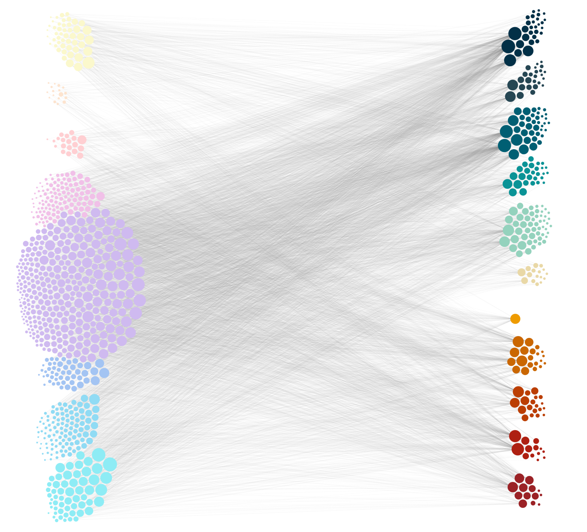
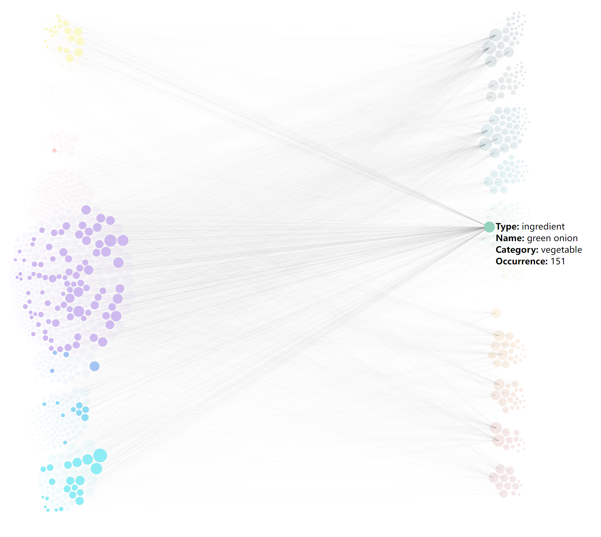
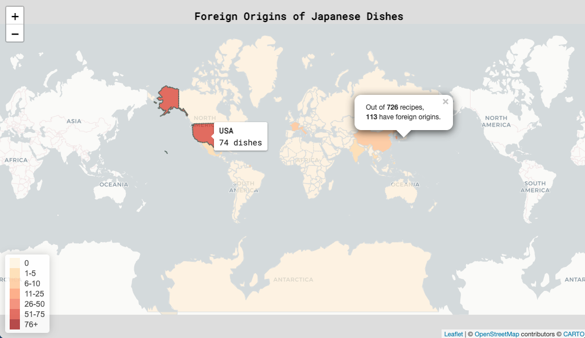
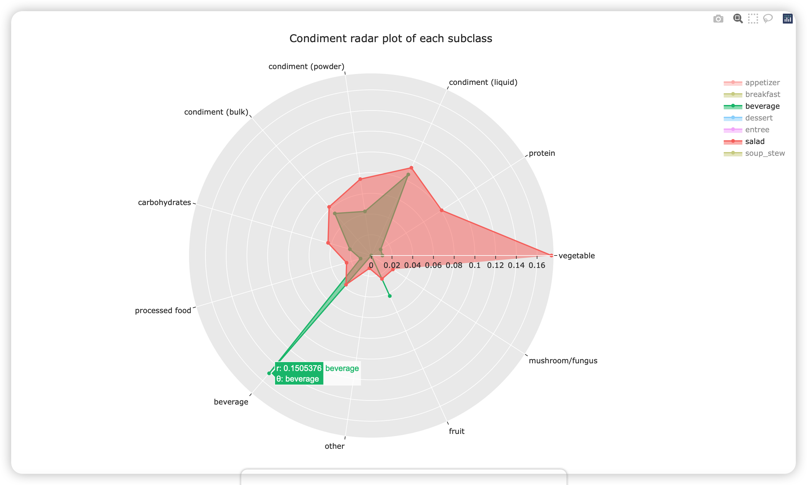
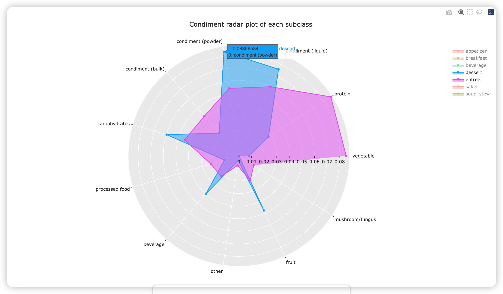
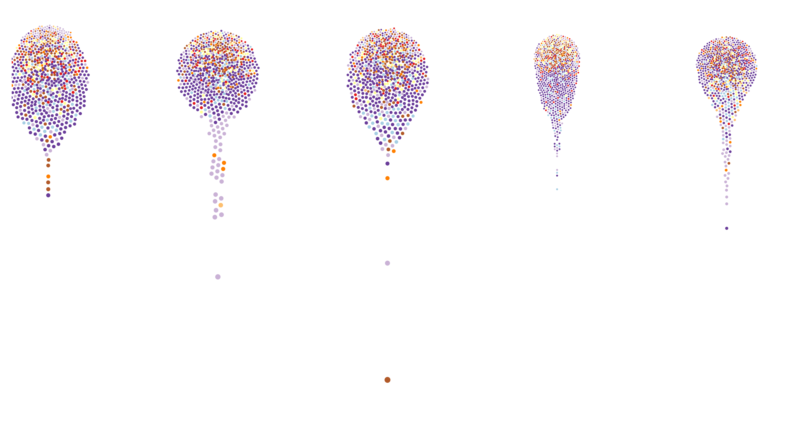
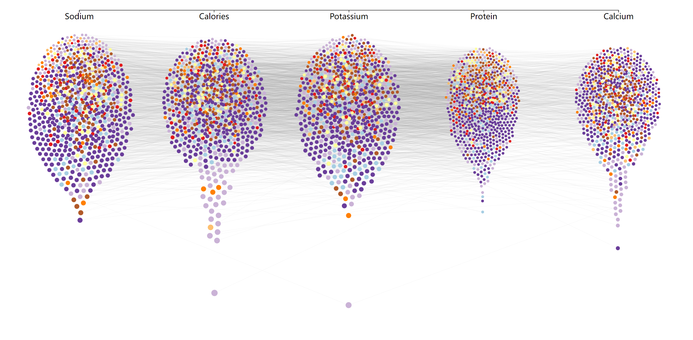
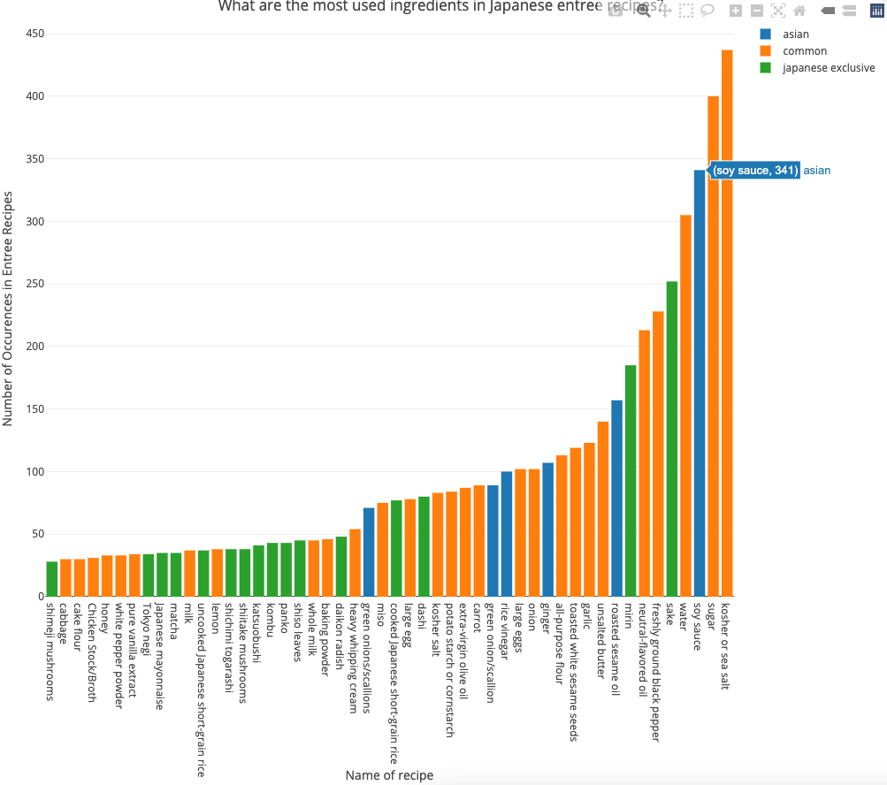

# Midpoint Report of Group 2

2022-04-09
## Team

- Jingsong Gao (jg2109)
- Yu Kang (yk685)
- Chao Li (cl1486)
- Ercong Luo (el890)
- Rui Qiu (rq47)

Mid-point delivery: work in progress submission where most of the visualizations are developed but not finalized.

Our midpoint submission consists of two major parts:

- The [`index.html`](../index-midpoint.html) page contains five separate visualizations, which will be discussed in the following sections.
- The [`midpoint.md`](midpoint.md) includes our development status quo of the project and our next steps.

## 1. The Core Network

### Design Rationale

#### Interaction

By using d3.js, we allow users to interact with the visualization by:

- zooming in/out the network to change the visual scale
- dragging the network to translate the visualization
- clicking on nodes to show the adjacent nodes (recipe node only have adjacent ingredient nodes, vice versa)
- hovering on nodes to show the detail information of nodes(type of node, name of recipe/ingredient, category, degree of node)

#### Data Abstraction

The dataset used in this visualization is a single JSON file with the structure below.

```json
{
    "recipes": [
        {
            "type": "recipe",
            "id": "r_Agedashi Tofu",
            "name": "Agedashi Tofu",
            "category": "appetizer",
            "freq": 10
        },
        ...
    ],
    "ingredients": [
        {
            "type": "ingredient",
            "id": "i_oil",
            "name": "oil",
            "category": "condiment (liquid)",
            "freq": 354
        },
        ...
    ],
    "links": [
        {
            "source": "i_oil",
            "target": "r_Agedashi Tofu",
            "value": 1
        },
        ...
    ]
}
```

The `recipes` part contains 726 `recipe object`, each contains fields: `type`(always `“recipe”`), `name`(the name of recipe), `id`(name with `“r_”` prefix), `category`(can be appetizer, breakfast, entrée,…), `freq`(the number of ingredients).

The `ingredients` part contains 253`ingredient object`, each contains fields: `type`(always `“ingredient”`), `name`(the name of ingredient), `id`(name with `“i_”` prefix), `category`(can be vegetable, protein, condiment,…), `freq`(total occurrence of this ingredient).

The `links` part contains 6595 `link object`, each contains fields: `source`(always an `ingredient object` id), `target`(always a `recipe object` id), `value`(always `1`, a dummy attribute used in d3.js).

#### Task Abstraction

The task of this core network visualization is to enable user to explore the recipe-ingredient connectivity of the entire recipe dataset.

#### Visual Encoding Choices

The global visual encoding of this visualization is a **network viz** with 2 type of **nodes** (recipe/ingredient) and 1 type of **edges** (recipe-ingredient). The connection between a recipe node and a ingredient node indicates that the ingredient is used in the recipe.

In detail, we include more visual encodings to make the visualization more easy-to-understand:

- **Global split**: By using d3-force, all recipe nodes are restricted around the 1/5 width (or **left**) of the screen and all ingredient nodes are restricted around the 4/5 width (or **right**) of the screen.
- **Recipe split**: By using d3-force, recipe nodes with different category (appetizer, breakfast,…) are restricted around different height of the screen.
- **Ingredient spilt**: By using d3-force, ingredient nodes with different category ( vegetable, protein,…) are also restricted around different height of the screen.
- **Color of node**: The nodes are colored according to their category. And to better distinguish recipe/ingredient, they use two different color palettes.
- **Hover tooltip**: Tooltips are added to every nodes to show the detail information of the node, see `interaction` part.
- **Click action**: On clicking, the node been clicked and its adjacent nodes are highlighted while other nodes are set to low opacity, see `interaction` part.

### Progress

#### Any Change Since Proposal

The design of this core network visualization does not change since proposal.

#### Storytelling Goal/User Task

This core network visualization successfully enables user to explore the relationship between recipes and ingredients in multiple ways. Users are able to find many interesting insights and conclusions by interacting with this viz in their ways.

#### Todo List

- [ ] Add legends for node colors
- [ ] Tweak positions of node groups
- [ ] Add selection of multiple nodes or a node group
- [ ] Add search bar to locate nodes by name/category
- [ ] Tweak styles
- [ ] Take a look at [`sigmajs`](https://github.com/JohnCoene/sigmajs) to see if it could solve the performance issue

### Screenshots

>  Add at least one screenshot to your document that illustrates your current prototype. Make sure that all of the views you have implemented so far are documented in screenshots, you may need more than one.





### Data Preprocessing Pipeline

There are 3 main components in the data preprocessing pipeline:

- **Data structure transformation**: The data unit of original dataset is one JSON file contains the information of a recipe, and the ingredients are stored inside the recipe JSON. To use the dataset in network viz, we transformed it to the **”recipe nodes, ingredient nodes, link edges”** structure (see `data abstraction` part).
- **Synonym merging**: Due to variability of text, there are more than 1000 ingredients in the original dataset. We **manually** assigned synonyms for these ingredients. For example, “kosher salt”, “sea salt”, “kosher or sea salt”, “flake sea salt”, “coarse sea salt” are all merged to “salt”.
- **Categorizing**: The recipes are already categorized into 8 types in the original dataset: **appetizer, beverage, breakfast, dessert, entrée, salad, side, and soup-stew**. The ingredients are **manually** labeled into 11 types: condiment (powder), condiment (bulk), condiment (liquid), protein, vegetable, fruit, mushroom/fungus, carbohydrates, processed food, beverage, and other.


## 2. Foreign-origin Dishes in Japanese Cuisine

### Design Rationale

#### Interaction

Although our dataset is not ideal for geospatial visualization, we still manage to extract some anectotes presentable on a map. Arguably, we could use a better visual representation such as a bar chart, an arc diagram, or even a tree map to show the origins of foreign dishes in Japanese cuisine. However, as geospatial visualization is required for the project, a leaflet interactive map is implemented for this part.

The only two interaction components (by far) are:

- The hovering tooltip on the highlighted countries, where a window of text information is displayed.
- The panning and zooming controls of the map could allow the user to explore the map in a more intuitive way.
### Data Abstraction

The dataset used here is `international-dishes.csv` which is a summary of previously scraped data. It is a 10-by-3 table, where the columns are country `name`, `total` number of dishes originated from this country, and the `code` of the country.

Another variation of the dataset `international-dishes-cat.csv` is generated by the same script `get-dishes-origin.R`. It's the same summary data by divided by the dish category.

An additional data source is used for the visualization:

- `world-110m.geojson` from [TopoJSON](https://github.com/topojson/world-atlas) is used to generate the country and land collection.

We can join the two datasets by country names and use the combined information for plotting a choropleth.

#### Task Abstraction

The task here is to give the audience a rough idea about the foreign origins of the dishes in Japanese cuisine.

#### Visual Encoding Choices

Some considerations in visual encoding:

- Two types of fonts are used: Roboto (sans-serif) and Roboto Mono (monospace). The Sans-Serif font is used for descriptive texts such as the title and legend title. The monospace font is used for numbers and miscellaneous texts.
- The thresholds of the legends are not proportional the the real gap. But considering the size of the data presented in the map, the priority is to show the difference in quantity. Therefore, the gaps between thresholds are set manually.
- The border of a country is highlighted when the mouse is hovering over it to make it more visually disinguishable
- A popup mark is added to highlight the country of interest, Japan.

### Progress

#### Any Change Since Proposal

The design of the map is consistent with the proposal.

#### Storytelling Goal/User Task

Our story focuses on answering "what makes Japanese food Japanese", and this visualization gives another perspective to show the influence of foreign cusines on Japanese food. That is to say, the authenticity of a country's dish, although might be defined by its unique set of ingredients, it is still inevitable to ignore external impacts.
### Todo List

- [ ] Tweak the visualization styles to match the overall theme
    - [ ] Modify the title style
    - [ ] Add a caption
    - [ ] Modify the legend style
- [ ] As the map tile's option of `unwrap` is set to be `FALSE`, the map is continuously horizontally scrollable, but only the one in the center is masked with the informative layer. Need to work on this later.
- [ ] Add a chart (e.g. a bar chart of number of dishes by category) within a tooltip
- [ ] (Optional) Add arcs to the the connections between Japan and origin countries.

### Screenshots



### Data Preprocessing Pipeline

- The preprocessing pipeline can be accessed at `data_for_viz/02-map/get-dishes-origin.R`. It can be concluded in the following three steps:
    - Iteratively load JSON files from `data/` directory and save the sub-directory information as `category` of a dish.
    - Count the total number of dishes by origin (and by category).
    - Mutate the country adjective to country name and code (e.g. “American” to “United States” and “USA”).
    - Save the summarized data to `international-dishes.csv` and `international-dishes-cat.csv` respectively.

## 3. Radar Plot of Ingredients

### Design Rationale

#### Interaction

By using `Plotly`, we allow users to interact with the visualization by:

- zooming in/out the radar plot to change the visual scale
- with the mouse pointing, the plot will show the detailed proportion of each condiment
- there is a filter in the legend, which it provides users with the selection

#### Data Abstraction

| Type               | **appetizer** | beverage | .... |
| ------------------ | ------------- | -------- | ---- |
| vegetable          | 24            | 1.0      | .... |
| protein            | 24            | 1.0      | .... |
| condiment (liquid) | 21            | 8.0      | .... |
| condiment (powder) | 17            | 4.0      | .... |
| condiment (bulk)   | 12            | 5.0      | .... |
| carbohydrates      | 9             | 2.0      | .... |
| processed food     | 8             | 1.0      | .... |
| beverage           | 6             | 14.0     | .... |

All ingredients are classified into  9 classes (`vegetable`, `protein`, ....). Each number in the table represents the count of ingredients in the current class of recipes. For instance, `appetizer` - `vegetable` - `24` represents the all the recipe of appetizer includes 24 different kinds of vegetable condiments (such as `asparagus`, `carrot`).

#### Task Abstraction and Visual Encoding Choices

The task of this radar plot visualization is to enable users to explore the recipe-ingredient relationship of the entire recipe dataset. To solve the task,  the global visual encoding of this visualization is depending on the python package **plotly**. The main plot type is coming from [**Radar chart**](https://plotly.com/python/radar-chart/).

In detail, the overall task was split into the following detailed visualization encoding choices:

- **Radar plot**: To compare the different proportions of ingredients.
- **Color theme**: `ggplot2` color theme was selected to be blindness-friendly.
- **Legend selector** By clicking the legend, the plot could add/drop a certain class of recipe to help comparison.
- **Notation of the plot**: Interactive detail of the data was added to the plot with the notation function.

### Progress

#### Any Change Since Proposal

The design of this core network visualization does not change since proposal.

#### Storytelling Goal/User Task

This radar plot helps user to compare the proportion of each subclass recipe, finding out what is the core component for the Japanese dishes.

#### Todo List

- [ ] Change the layout of the radar background
- [ ] Rescale the radar range
- [ ] Tweak styles

### Screenshots





### Data Preprocessing Pipeline

There are 3 main components in the data preprocessing pipeline:

- **Data structure transformation**: The data unit of original dataset is one JSON file contains the information of a recipe, and the ingredients are stored inside the recipe JSON. To use the dataset in radar chart, we transformed it to the **”ingredient type, ingredient, count”** structure (see `data abstraction` part).
- **Synonym merging**: Due to variability of text, there are more than 1000 ingredients in the original dataset. We **manually** assigned synonyms for these ingredients. For example, “kosher salt”, “sea salt”, “kosher or sea salt”, “flake sea salt”, “coarse sea salt” are all merged to “salt”.
- **Categorizing**: The recipes are already categorized into 8 types in the original dataset: **appetizer, beverage, breakfast, dessert, entrée, salad, side, and soup-stew**. The ingredients are **manually** labeled into 11 types: condiment (powder), condiment (bulk), condiment (liquid), protein, vegetable, fruit, mushroom/fungus, carbohydrates, processed food, beverage, and other.

## 4. Beeswarm Plot of Common Nutrients

### Design Choices for the Beeswarm Visualization

Once we figured out our data(the dish dataset) and our target(visualize Japanese favorite dishes), nutrition is regarded as a critical dimension for the dishes, and beeswarm plot would be a fancy way to visualize the nutritional information of those dishes, since it enables us to quickly identify the distribution of values along several categories, corresponding to the categories of nutrients we are to visualize.

Regarding this beeswarm plot, the very first idea was to clean the JSON data into a dataframe whose observational unit is the value of a nutrient for a single dish, remove outliers, then plot the observations as points in the beeswarm plots; however, it turns out that the number of different nutrients was too large for a single beeswarm plot, whose optimal clusters were 3-5 in practice, so the decision was to count the number of dishes with each category of nutrient, find the 5 most frequent nutrients, then take the subset of these nutrients.

Till this point, the plot looks like:



Soon another design problem was found: nutritional value of a dish is dissected into potentially 5 points! In order to show the integrity of a single dish, it would be better to draw edges between nodes representing the same dish, but not all dishes there in the dataset have possessed all the 5 nutrients to make all the 4 intra-cluster edges! Here, the decision was to filter the dishes again to include only those with the 5 nutrients, and connect nodes representing the same dish.

Till this point, the plot looks like:



Now, before adding tooltips and annotations, it turns out that by the current setting of Y-axis transformation the distributions of 5 nutrients were all somewhat similar, in a balloon shape and with similar range. In the original data, these categories all have numeric values in different range, respect to certain nutrients. Here, since the overall goal is to analyze the nutritional pattern of these foods, we decided to scale the value of nutrients by their recommended daily amount. Here we decided to set the normal level of a dish as 1/5 of daily recommended amount, log-transform the data to make clusters more connected, and add the annotation of the recommended level at the left side of the plot. We also provided a multi-functional tooltip reacting to both mouseover and mouse click; when users hover their mouse over a node, all the nodes and edges referring to the same dish would be highlighted, the name of dish would be displayed by the node; if users get interested on a certain dish, they could click on any node referring to that dish to apply an even more highlighted effect on the connected nodes/edges, plus the exact nutritional information of the dish displayed at the top left corner.

Till this point, the plot looks like:


- [ ] This is the current stage of our beeswarm plot. During the development of the whole project, this plot could help us identify several critical insights about the nutritional pattern of these dishes. First of all, the nutritions display a strong pattern between different types of dishes(appetizers, dessert, etc.); also, even though the beeswarm plot has somewhat distorted the exact location of any given point, the recommended level represented by the finger image still tells us that comparing to regular nutrients like calories and protein, these foods may have possesses less micro-nutrients like potassium and calcium.

### Todo List

- [ ] Although this plot does not help much in identifying the Japanese dish, it is still a powerful tool to visualize and browse the dataset, and more functions could be added into it later, like dish-searching, plot-legends, hyperlinks to actual recipe webpages, etc.
- [ ] We might add intra-cluster sub-clusters to organize dishes by category under the same nutrient. For now the visualization looks a little bit messy.

## 5. The Most Recurrent Ingredients in Japanese Entrée Recipes (barplot)

### Screenshot



### Data Abstraction

The raw dataset is the JSON file as stated earlier. The counts of occurrences of ingredients in entrée recipes are counted and exported as as csv file using the script `data_for_viz/05-barplot/get-ingredients.R`.

A second .csv file is directly exported from https://trends.google.as/trends/?geo=US by searching all the relevant ingredients. This is time series data that will go into the next implemented feature in this visualization.

### Visual Encoding Choices

The x-axis that is the list of most recurrent ingredients is sorted according to how many times the ingredients appeared in recipes. This a conscious design choice that will complement the next iteration of this figure, which is to have a boxplot or violin plot that is a statistical visualization of google search trends on each ingredient. The two subplots will share the same x-axis, and whether the box plot or violin plot will have the same left-to-right increasing trend is going to help readers see whether there is a correlation between how recurrent an ingredient is in Japanese dishes vs how frequently searched the ingredient is. If the correlation is high, then it means that authentic Japanese ingredients are not overrated by the general public that use google search.

### Progress

#### Any Change Since Proposal

The additional feature of adding the time-series statistics subplot is a new idea. This is yet to be implemented.

#### Todo List

- [ ] The next step to complete the visualization is to see a correlation between how recurrent an ingredient in Japanese entrée dishes, and how frequently searched these ingredients are. The x-axis of the barplot is sorted according to occurrences so that a plot below can share the same axis, and a reader will be able to clearly see whether the statistical summaries such as average google search rate trends up from left to right just like the top plot. This feature implementation is in progress.
