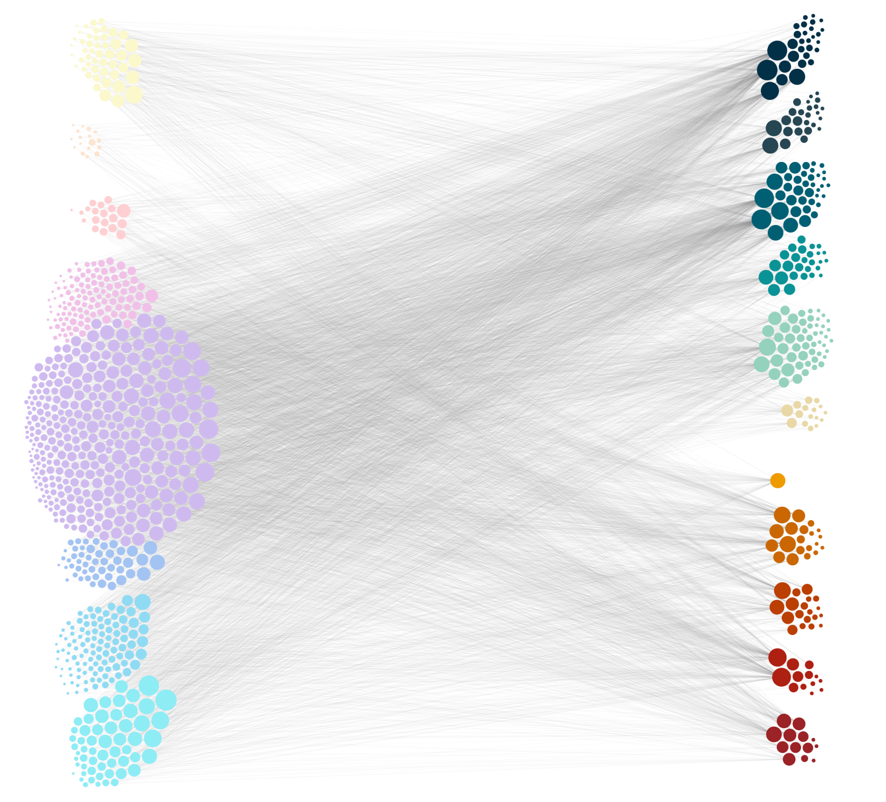
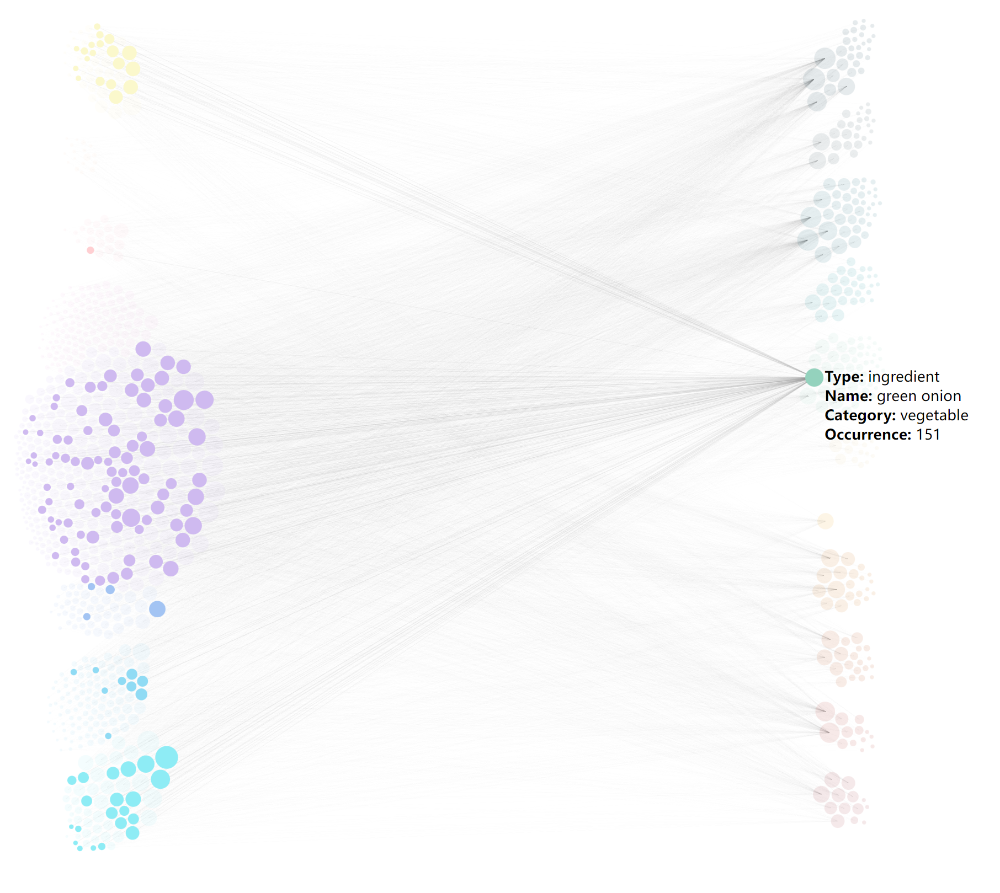

# Writeup for Part 01

Author: Jingsong Gao

## Design Rationale

### interaction

By using d3.js, we allow users to interact with the visualization by:

- zooming in/out the network to change the visual scale
- dragging the network to translate the visualization
- clicking on nodes to show the adjacent nodes (recipe node only have adjacent ingredient nodes, vice versa)
- hovering on nodes to show the detail information of nodes(type of node, name of recipe/ingredient, category, degree of node)

### data abstraction

> (including a characterization of the raw data types and their scale/cardinality, and of any derived data that you decided to compute)

The dataset used in this visualization is a single JSON file with the structure below.

```json
{
    "recipes": [
        {
            "type": "recipe",
            "id": "r_Agedashi Tofu",
            "name": "Agedashi Tofu",
            "category": "appetizer",
            "freq": 10
        },
        ...
    ],
    "ingredients": [
        {
            "type": "ingredient",
            "id": "i_oil",
            "name": "oil",
            "category": "condiment (liquid)",
            "freq": 354
        },
        ...
    ],
    "links": [
        {
            "source": "i_oil",
            "target": "r_Agedashi Tofu",
            "value": 1
        },
        ...
    ]
}
```

The `recipes` part contains 726 `recipe object`, each contains fields: `type`(always `“recipe”`), `name`(the name of recipe), `id`(name with `“r_”` prefix), `category`(can be appetizer, breakfast, entrée,…), `freq`(the number of ingredients). 

The `ingredients` part contains 253`ingredient object`, each contains fields: `type`(always `“ingredient”`), `name`(the name of ingredient), `id`(name with `“i_”` prefix), `category`(can be vegetable, protein, condiment,…), `freq`(total occurrence of this ingredient).

The `links` part contains 6595 `link object`, each contains fields: `source`(always an `ingredient object` id), `target`(always a `recipe object` id), `value`(always `1`, a dummy attribute used in d3.js).

### task abstraction

The task of this core network visualization is to enable user to explore the recipe-ingredient connectivity of the entire recipe dataset. 

### visual encoding choices

The global visual encoding of this visualization is a **network viz** with 2 type of **nodes** (recipe/ingredient) and 1 type of **edges** (recipe-ingredient). The connection between a recipe node and a ingredient node indicates that the ingredient is used in the recipe.

In detail, we include more visual encodings to make the visualization more easy-to-understand:

- **Global split**: By using d3-force, all recipe nodes are restricted around the 1/5 width (or **left**) of the screen and all ingredient nodes are restricted around the 4/5 width (or **right**) of the screen. 
- **Recipe split**: By using d3-force, recipe nodes with different category (appetizer, breakfast,…) are restricted around different height of the screen.
- **Ingredient spilt**: By using d3-force, ingredient nodes with different category ( vegetable, protein,…) are also restricted around different height of the screen.
- **Color of node*: The nodes are colored according to their category. And to better distinguish recipe/ingredient, they use two different color palettes.
- **Hover tooltip**: Tooltips are added to every nodes to show the detail information of the node, see `interaction` part.
- **Click action**: On clicking, the node been clicked and its adjacent nodes are highlighted while other nodes are set to low opacity, see `interaction` part.

## Progress

### any change since proposal

The design of this core network visualization does not change since proposal.

### storytelling goal/user task

> describe how visualization enable the tasks you set out to facilitate or successfully communicate the story you want to tell

This core network visualization successfully enables user to explore the relationship between recipes and ingredients in multiple ways. Users are able to find many interesting insights and conclusions by interacting with this viz in their ways.

### todo list

- [ ] Add legends for node colors
- [ ] Tweak positions of node groups
- [ ] Add selection of multiple nodes or a node group
- [ ] Add search bar to locate nodes by name/category
- [ ] Tweak styles

## Screenshots

>  Add at least one screenshot to your document that illustrates your current prototype. Make sure that all of the views you have implemented so far are documented in screenshots, you may need more than one.





## Data Preprocessing Pipeline

There are 3 main components in the data preprocessing pipeline:

- **Data structure transformation**: The data unit of original dataset is one JSON file contains the information of a recipe, and the ingredients are stored inside the recipe JSON. To use the dataset in network viz, we transformed it to the **”recipe nodes, ingredient nodes, link edges”** structure (see `data abstraction` part).
- **Synonym merging**: Due to variability of text, there are more than 1000 ingredients in the original dataset. We **manually** assigned synonyms for these ingredients. For example, “kosher salt”, “sea salt”, “kosher or sea salt”, “flake sea salt”, “coarse sea salt” are all merged to “salt”.
- **Categorizing**: The recipes are already categorized into 8 types in the original dataset: **appetizer, beverage, breakfast, dessert, entrée, salad, side, and soup-stew**. The ingredients are **manually** labeled into 11 types: condiment (powder), condiment (bulk), condiment (liquid), protein, vegetable, fruit, mushroom/fungus, carbohydrates, processed food, beverage, and other.
