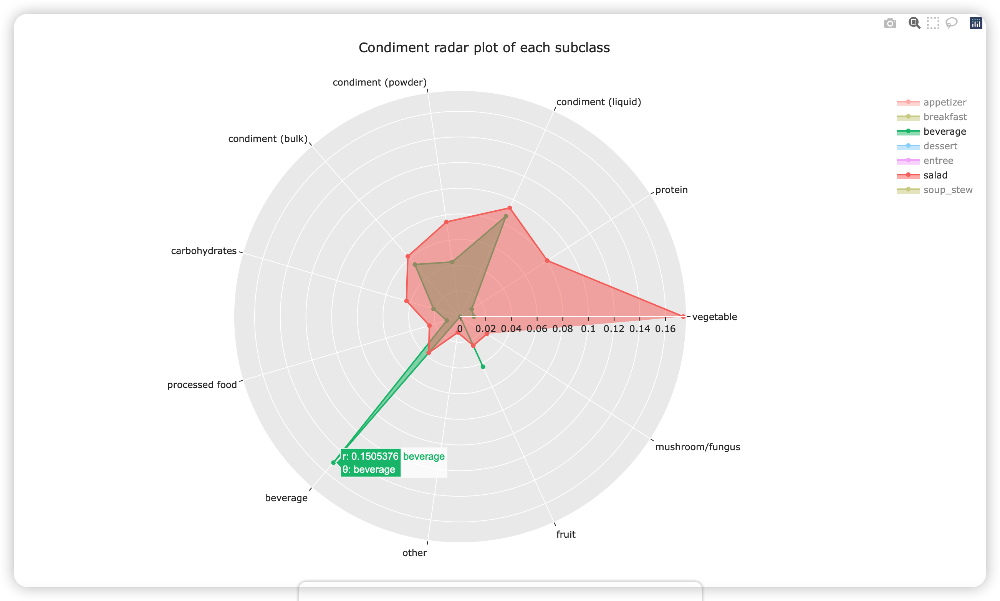
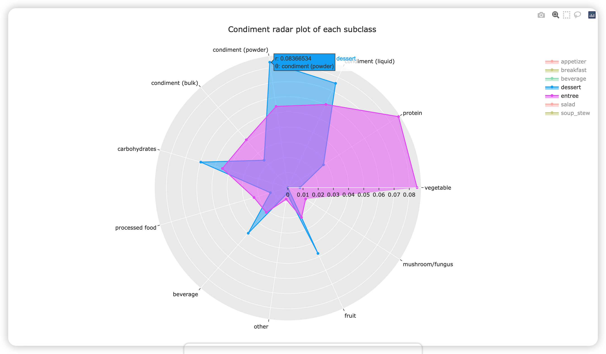

# Writeup for Part 01
Author: Chao Li

## Design Rationale

### interaction

By using `Plotly`, we allow users to interact with the visualization by:

- zooming in/out the radar plot to change the visual scale
- with the mouse pointing, the plot will show the detailed proportion of each condiment
- there is a filter in the legend, which it provides users with the selection

### data abstraction

#### Raw data

> (including a characterization of the raw data types and their scale/cardinality, and of any derived data that you decided to compute)

The orginal dataset used in this visualization is a single JSON file with the structure below.

```json
{
    "recipes": [
        {
            "type": "recipe",
            "id": "r_Agedashi Tofu",
            "name": "Agedashi Tofu",
            "category": "appetizer",
            "freq": 10
        },
        ...
    ],
    "ingredients": [
        {
            "type": "ingredient",
            "id": "i_oil",
            "name": "oil",
            "category": "condiment (liquid)",
            "freq": 354
        },
        ...
    ],
    "links": [
        {
            "source": "i_oil",
            "target": "r_Agedashi Tofu",
            "value": 1
        },
        ...
    ]
}
```

The `recipes` part contains 726 `recipe object`, each contains fields: `type`(always `“recipe”`), `name`(the name of recipe), `id`(name with `“r_”` prefix), `category`(can be appetizer, breakfast, entrée,…), `freq`(the number of ingredients). 

The `ingredients` part contains 253`ingredient object`, each contains fields: `type`(always `“ingredient”`), `name`(the name of ingredient), `id`(name with `“i_”` prefix), `category`(can be vegetable, protein, condiment,…), `freq`(total occurrence of this ingredient).

The `links` part contains 6595 `link object`, each contains fields: `source`(always an `ingredient object` id), `target`(always a `recipe object` id), `value`(always `1`, a dummy attribute used in d3.js).

#### Derived data

| Type               | **appetizer** | beverage | .... |
| ------------------ | ------------- | -------- | ---- |
| vegetable          | 24            | 1.0      | .... |
| protein            | 24            | 1.0      | .... |
| condiment (liquid) | 21            | 8.0      | .... |
| condiment (powder) | 17            | 4.0      | .... |
| condiment (bulk)   | 12            | 5.0      | .... |
| carbohydrates      | 9             | 2.0      | .... |
| processed food     | 8             | 1.0      | .... |
| beverage           | 6             | 14.0     | .... |

All ingredients are classified into  9 classes (`vegetable`, `protein`, ....). Each number in the table represents the count of ingredients in the current class of recipes. For instance, `appetizer` - `vegetable` - `24` represents the all the recipe of appetizer includes 24 different kinds of vegetable condiments (such as `asparagus`, `carrot`).

### task abstraction and visual encoding choices

The task of this radar plot visualization is to enable users to explore the recipe-ingredient relationship of the entire recipe dataset. To solve the task,  the global visual encoding of this visualization is depending on the python package **plotly**. The main plot type is coming from [**Radar chart**](https://plotly.com/python/radar-chart/). 

In detail, the overall task was split into the following detailed visualization encoding choices:

- **Radar plot**: To compare the different proportions of ingredients.
- **Color theme**: `ggplot2` color theme was selected to be blindness-friendly.
- **Legend selector** By clicking the legend, the plot could add/drop a certain class of recipe to help comparison.
- **Notation of the plot**: Interactive detail of the data was added to the plot with the notation function.

## Progress

### any change since proposal

The design of this core network visualization does not change since proposal.

### storytelling goal/user task

> describe how visualization enable the tasks you set out to facilitate or successfully communicate the story you want to tell

This radar plot helps user to compare the proportion of each subclass recipe, finding out what is the core component for the Japanese dishes.

### todo list

- [ ] Change the layout of the radar background
- [ ] Rescale the radar range
- [ ] Tweak styles

## Screenshots

>  Add at least one screenshot to your document that illustrates your current prototype. Make sure that all of the views you have implemented so far are documented in screenshots, you may need more than one.





## Data Preprocessing Pipeline

There are 3 main components in the data preprocessing pipeline:

- **Data structure transformation**: The data unit of original dataset is one JSON file contains the information of a recipe, and the ingredients are stored inside the recipe JSON. To use the dataset in radar chart, we transformed it to the **”ingredient type, ingredient, count”** structure (see `data abstraction` part).
- **Synonym merging**: Due to variability of text, there are more than 1000 ingredients in the original dataset. We **manually** assigned synonyms for these ingredients. For example, “kosher salt”, “sea salt”, “kosher or sea salt”, “flake sea salt”, “coarse sea salt” are all merged to “salt”.
- **Categorizing**: The recipes are already categorized into 8 types in the original dataset: **appetizer, beverage, breakfast, dessert, entrée, salad, side, and soup-stew**. The ingredients are **manually** labeled into 11 types: condiment (powder), condiment (bulk), condiment (liquid), protein, vegetable, fruit, mushroom/fungus, carbohydrates, processed food, beverage, and other.