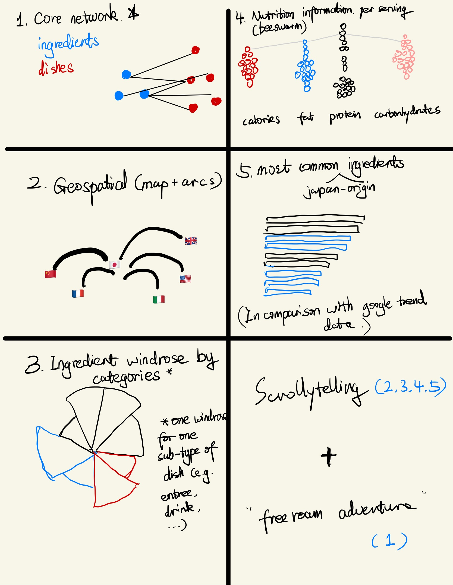

# ANLY-503 Project Proposal

## Team

- Jingsong Gao (jg2109)
- Yu Kang (yk685)
- Chao Li (cl1486)
- Ercong Luo (el890)
- Rui Qiu (rq47)

## Basic information

**Project title**: A Data Science Breakdown: What Ingredients Are You Tasting in Authentic Japanese Flavors?

## Overview

More than 30,000 Japanese restaurants are in business in the U.S., and the number keeps on growing at 5% per year on average. However, such growth has brought complaints about these "harbored" Japanese food, especially concerning the authenticity of restaurant recipes. In order to give data science insights in authentic Japanese flavors and ingredient combinations to users, we plan to develop a web-form story-telling narrative based on a collection of 800+ authentic Japanese recipes, collected from a [public website](https://www.justonecookbook.com/). The storytelling will guide users through aspects of Japanese cuisine, such as ingredients list and nutrition; users will also be allowed to explore various facets of dishes interactively with the network visualization, developing a hollistic understanding of Japanese cuisine and becoming ready for their further exploration on the art of Japanese cooking.

## Detailed description of the data and data preprocessing

### Data source

We scraped the data from a blog called ***[Just One Cookbook](https://www.justonecookbook.com/yaki-onigiri-grilled-rice-ball/)***, and each recipe is stored a JSON file. The raw is stored in our project repository under the directory `data`. The repository is accessible at [https://github.com/anly503/project-spring-2022-project-group-2](https://github.com/anly503/project-spring-2022-project-group-2).

### Data description

We plan to visualize the recipes of more than 800+ authentic Japanese dishes. For each recipe, it has the following 8 attributes:

- `name`

- `summary`

- `image_url`

- `cuisine`. The origin of the dish.

- `keywords`

- `ingredients`. An array of ingredients. Each ingredient has a `name` and a `raw_text` (in case of failed regex matching).

- `nutrition`. An array of nutritional information. Each nutrition has a `nutrition`, a `value` and a `unit` attribute.

- Note that a recipe also belongs to a dish `category`, which is the name of the directory under `data`.

- We are considering the possibility of manually labeling the flavor of each dish. Most of the visualization will be built around data fields `ingredients` and `nutrition`.

### Preprocessing

- As each dish is stored in a separate JSON file, we will first combine the raw data into one large JSON file.
- There is no need to join multiple datasets. But we probably would like to add a new variable based on which category a dish falls into.
- An additional JSON file indicating the node-link relationship between ingredients will be created separately.
- The nutritional information will be converted to unit per serving.
- The preprocessing pipeline could be done in two ways: either by updating the Python scraping script to get a ready-to-use dataset, or by R `tidyverse` which is naturally compatible with `ggplot2` static visualization. We will decide this later.
- Due to the nature of our dataset, the geospatial visualization is done by plotting the origins of the international dishes that appear in Japanese cuisine. We might need some extra background knowledge to implement this. Luckily, the workload of this step is relatively small as there are only less than 50 dishes fitting this criteria.

## Usage scenarios & tasks

> Use case: Mary is a Japanese American who loves to cook. She notices that Japanese restaurants in the U.S. tastes different from what she ate in Japan, but is unaware of the source of this difference. She wants to learn about traditional Japanese recipes and find out the ingredients that account for the difference in taste. By browsing our storytelling, she realized that the lack of "dashi" was one reason for the inauthentic Japanese restaurants in the U.S., which helped her make more authentic Japanese food.

## Description of your visualization and sketch

- An interactive network of dishes and ingredients.
- A interactive map representing the origins of dishes.
- A static windrose plot of ingredient usage by category of a Japanese dish.
- A static nutrition beeswarm of traditional Japanase dishes.
- A static bar plot of the most common ingredients in Japanese dishes, comparing to [Google Trends popularity](https://trends.google.com/trends/explore?date=all&geo=US&q=%2Fm%2F0169z_,%2Fm%2F057z_).

- Innovative view component: No similar visualization currently exists on the Internet. Most of the visualizations related to food or nutritional science focus on delivering information to the user directly. Our approach is to create a visualization that is not only visually appealing but also provides a more intuitive way of interacting with the data, encouraging the user to explore the inter-recipe relationships. Admittedly, we are not building something epic from the ground up, but rather presenting a creative combination as something truly useful.

## Work breakdown and schedule

- Preliminary data cleaning with aggregation. (15 hrs)
- Create draft visualizations. (15 hrs)
- Decide our font and color palette choice. Test on visualizations. (5 hrs)
- Engineer the scrollytelling component and combine the static with the interactive. (20 hrs)
- Draft the storytelling narrative. (5 hrs)
- Write the final report and proofread. (5 hrs)